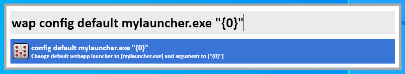
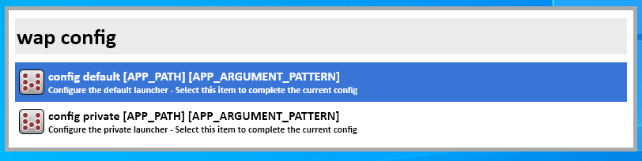

# To install in Wox
```
wpm install WebApp launcher
```

# Wox WebApp plugin

A Wox plugin to start url in a "Web app" mode.

Require Chrome installed to work out of the box.

Can be configured to work with another "web app launcher"

# Example 

## Basic usage

Enter the following command to learn wap few url to transform into webapps:

```
wap add https://maps.google.com/ directions
wap add https://youtube.com/ video google
wap add https://google.com/ search engine
wap add https://bing.com/ microsoft ms search engine
```

Now search for url:

```
wap list
```

You'll see some url:


You can select https://maps.google.com/ and it will start the url using Chrome in WebApp mode:


## Filters

you can obviously filter on url

```
wap list google.com
```


or on keywords

```
wap list video
```


or both

```
wap list google
```


## Quick filter

You don't need to write `list` if the query is not ambiguous. All the previous examples may have been written as:

```
wap google.com
wap video
wap google
```

# Advanced configuration

If you want to use something else to start your urls as a webapp, you can configure the plugin using `wap config`.

Imagine you have a file called mylauncher.exe that can start webapps given an url as argument. You can then type to edit the default profile:

```
wap config default mylauncher.exe "{0}"
```


You can also add a new profile named "edge":

```
wap config edge msedge.exe --app="{0}"
```


You can list the profiles by typing:

```
wap config
```


Then, by selecting a profile, it will auto-complete with current configuration.

```
wap config default chrome.exe --app="{0}" --profile-directory="Default"
```


Default configuration is :
```
wap config default chrome.exe --app="{0}" --profile-directory="Default"
```
## Multiple browsers

You can use the profiles to open some webapp with Chrome, and other webapp with Edge:

```
wap config default chrome.exe --app="{0}" --profile-directory="Default"
wap config edge msedge.exe --app="{0}" --profile-directory="Default"
```

And then the following url will be opened by Chrome (default profile):
```
wap add https://www.google.com/ search engine google
```

But the following url will be opened by Edge (edge profile):
```
wap add https://www.micrsoft.com/ ms [edge]
```

## Multiple profiles inside Chrome

You can use the profiles to open some webapp with a Chrome profile, and other webapp with another Chrome profile

```
wap config default chrome.exe --app="{0}" --profile-directory="Default"
wap config pro chrome.exe --app="{0}" --profile-directory="Pro"
```

And then the following url will be opened by Chrome profile "Default":
```
wap add https://www.google.com/ search engine google
```

But the following url will be opened by Chrome profile "Pro" (pro profile):
```
wap add https://www.micrsoft.com/ ms [pro]
```

## Starting some webapp with private mode

You can use the profiles to open some webapp with standard mode, and other webapp with private/incognito mode

```
wap config default chrome.exe --app="{0}" --profile-directory="Default"
wap config private chrome.exe --app="{0}" --profile-directory="Default" --incognito
```

And then the following url will be opened in standard mode:
```
wap add https://www.google.com/ search engine google
```

But the following url will be opened in private mode:
```
wap add https://www.micrsoft.com/ ms [private]
```
